Wine Quality Analysis
================
Kusum Anand
May 31, 2018

# Abstract

With globalization,increased connectivity and globetrotting, wine
drinking has surely taken off especially in non traditional wine
drinking market,wine is easily accessible off the supermarket
shelves.That being said, the average consumer would want an affordable
wine that is easy on the palate.However for a wine connoisseur, fine
wine quality brings diversity, attributed to sensory perceptions formed
by complex interactions of the compounds in the wine making process. As
the Latin phrase goes,“In vino veritas” meaning “in wine there is truth”
, we shall explore the red and white wine datasets to understand how
their physicochemical properties influence the ‘objective’ quality of
wine.

# Introduction

The red and white wine sample datasets consists of inputs from objective
tests (e.g. PH values) and the output is based on sensory data(median of
at least 3 evaluations made by wine experts). Each expert has graded the
wine quality between 0 (very bad) and 10 (very excellent). We shall
analyse what constitutes the nature of the wine to be graded on quality.

The two datasets are related to red and white variants of the Portuguese
“Vinho Verde” wine.For more details, visit:
<http://www.vinhoverde.pt/en/> or the reference \[Cortez et al.,
2009\].Due to privacy and logistic issues, only physicochemical (inputs)
and sensory (the output) variables are available (e.g. there is no data
about grape types, wine brand, wine selling price, etc.The quality of
the wine has been rated with values ranging from 0 (very bad) to 10
(very excellent).

Input variables (based on physicochemical tests):

1.  fixed acidity (tartaric acid - g / dm^3)
2.  volatile acidity (acetic acid - g / dm^3)
3.  citric acid (g / dm^3)
4.  residual sugar (g / dm^3)
5.  chlorides (sodium chloride - g / dm^3
6.  free sulfur dioxide (mg / dm^3)
7.  total sulfur dioxide (mg / dm^3)
8.  density (g / cm^3)
9.  pH
10. sulphates (potassium sulphate - g / dm3)
11. alcohol (% by volume)

Output variable (based on sensory data):

12. quality (score between 0 and 10)

The wine data will be analysed from an ‘objective quality’ perspective,
understand how the physicochemical properties of the wine influence the
perception of quality of the wine.This report analyses both red and
white wine datasets and how the two differ in terms of quality based on
the same set of properties.

# Data Exploration

Note that the dataset is in tidy format rendering them ready to
manipulate and visualize.Lets begin by loading in the required libraries
and the data
    set.

    ##   X fixed.acidity volatile.acidity citric.acid residual.sugar chlorides
    ## 1 1           7.4             0.70        0.00            1.9     0.076
    ## 2 2           7.8             0.88        0.00            2.6     0.098
    ## 3 3           7.8             0.76        0.04            2.3     0.092
    ##   free.sulfur.dioxide total.sulfur.dioxide density   pH sulphates alcohol
    ## 1                  11                   34  0.9978 3.51      0.56     9.4
    ## 2                  25                   67  0.9968 3.20      0.68     9.8
    ## 3                  15                   54  0.9970 3.26      0.65     9.8
    ##   quality
    ## 1       5
    ## 2       5
    ## 3       5

    ##   X fixed.acidity volatile.acidity citric.acid residual.sugar chlorides
    ## 1 1           7.0             0.27        0.36           20.7     0.045
    ## 2 2           6.3             0.30        0.34            1.6     0.049
    ## 3 3           8.1             0.28        0.40            6.9     0.050
    ##   free.sulfur.dioxide total.sulfur.dioxide density   pH sulphates alcohol
    ## 1                  45                  170  1.0010 3.00      0.45     8.8
    ## 2                  14                  132  0.9940 3.30      0.49     9.5
    ## 3                  30                   97  0.9951 3.26      0.44    10.1
    ##   quality
    ## 1       6
    ## 2       6
    ## 3       6

    ## 'data.frame':    1599 obs. of  13 variables:
    ##  $ X                   : int  1 2 3 4 5 6 7 8 9 10 ...
    ##  $ fixed.acidity       : num  7.4 7.8 7.8 11.2 7.4 7.4 7.9 7.3 7.8 7.5 ...
    ##  $ volatile.acidity    : num  0.7 0.88 0.76 0.28 0.7 0.66 0.6 0.65 0.58 0.5 ...
    ##  $ citric.acid         : num  0 0 0.04 0.56 0 0 0.06 0 0.02 0.36 ...
    ##  $ residual.sugar      : num  1.9 2.6 2.3 1.9 1.9 1.8 1.6 1.2 2 6.1 ...
    ##  $ chlorides           : num  0.076 0.098 0.092 0.075 0.076 0.075 0.069 0.065 0.073 0.071 ...
    ##  $ free.sulfur.dioxide : num  11 25 15 17 11 13 15 15 9 17 ...
    ##  $ total.sulfur.dioxide: num  34 67 54 60 34 40 59 21 18 102 ...
    ##  $ density             : num  0.998 0.997 0.997 0.998 0.998 ...
    ##  $ pH                  : num  3.51 3.2 3.26 3.16 3.51 3.51 3.3 3.39 3.36 3.35 ...
    ##  $ sulphates           : num  0.56 0.68 0.65 0.58 0.56 0.56 0.46 0.47 0.57 0.8 ...
    ##  $ alcohol             : num  9.4 9.8 9.8 9.8 9.4 9.4 9.4 10 9.5 10.5 ...
    ##  $ quality             : int  5 5 5 6 5 5 5 7 7 5 ...

    ## 'data.frame':    4898 obs. of  13 variables:
    ##  $ X                   : int  1 2 3 4 5 6 7 8 9 10 ...
    ##  $ fixed.acidity       : num  7 6.3 8.1 7.2 7.2 8.1 6.2 7 6.3 8.1 ...
    ##  $ volatile.acidity    : num  0.27 0.3 0.28 0.23 0.23 0.28 0.32 0.27 0.3 0.22 ...
    ##  $ citric.acid         : num  0.36 0.34 0.4 0.32 0.32 0.4 0.16 0.36 0.34 0.43 ...
    ##  $ residual.sugar      : num  20.7 1.6 6.9 8.5 8.5 6.9 7 20.7 1.6 1.5 ...
    ##  $ chlorides           : num  0.045 0.049 0.05 0.058 0.058 0.05 0.045 0.045 0.049 0.044 ...
    ##  $ free.sulfur.dioxide : num  45 14 30 47 47 30 30 45 14 28 ...
    ##  $ total.sulfur.dioxide: num  170 132 97 186 186 97 136 170 132 129 ...
    ##  $ density             : num  1.001 0.994 0.995 0.996 0.996 ...
    ##  $ pH                  : num  3 3.3 3.26 3.19 3.19 3.26 3.18 3 3.3 3.22 ...
    ##  $ sulphates           : num  0.45 0.49 0.44 0.4 0.4 0.44 0.47 0.45 0.49 0.45 ...
    ##  $ alcohol             : num  8.8 9.5 10.1 9.9 9.9 10.1 9.6 8.8 9.5 11 ...
    ##  $ quality             : int  6 6 6 6 6 6 6 6 6 6 ...

    ##  [1] TRUE TRUE TRUE TRUE TRUE TRUE TRUE TRUE TRUE TRUE TRUE TRUE TRUE

    ## [1] 1599   13

    ## [1] 4898   13

    ## 'data.frame':    1599 obs. of  13 variables:
    ##  $ X                   : int  4481 4589 1401 4066 3141 2540 3604 659 3213 3448 ...
    ##  $ fixed.acidity       : num  5.9 6.4 7.3 6.6 6.6 6.2 7 6.6 6.4 6 ...
    ##  $ volatile.acidity    : num  0.22 0.3 0.25 0.5 0.39 0.27 0.32 0.27 0.24 0.17 ...
    ##  $ citric.acid         : num  0.45 0.33 0.36 0.26 0.39 0.18 0.27 0.25 0.32 0.29 ...
    ##  $ residual.sugar      : num  22.6 5.2 13.1 11.3 11.9 1.5 7.1 3.1 0.95 9.7 ...
    ##  $ chlorides           : num  0.12 0.05 0.05 0.029 0.057 0.028 0.027 0.052 0.041 0.044 ...
    ##  $ free.sulfur.dioxide : num  55 30 35 32 51 20 37 41 23 33 ...
    ##  $ total.sulfur.dioxide: num  122 137 200 110 221 111 122 188 131 98 ...
    ##  $ density             : num  0.996 0.993 0.999 0.993 0.999 ...
    ##  $ pH                  : num  3.1 3.26 3.04 3.27 3.26 3.41 3.15 3.24 3.25 3.12 ...
    ##  $ sulphates           : num  0.35 0.58 0.46 0.78 0.51 0.5 0.6 0.4 0.35 0.36 ...
    ##  $ alcohol             : num  12.8 11.1 8.9 12.9 8.9 10 12.6 11.3 11.8 9.2 ...
    ##  $ quality             : int  5 5 7 8 6 5 7 5 5 6 ...

    ## [1] TRUE TRUE

    ## 'data.frame':    3198 obs. of  13 variables:
    ##  $ fixed.acidity       : num  7.4 7.8 7.8 11.2 7.4 7.4 7.9 7.3 7.8 7.5 ...
    ##  $ volatile.acidity    : num  0.7 0.88 0.76 0.28 0.7 0.66 0.6 0.65 0.58 0.5 ...
    ##  $ citric.acid         : num  0 0 0.04 0.56 0 0 0.06 0 0.02 0.36 ...
    ##  $ residual.sugar      : num  1.9 2.6 2.3 1.9 1.9 1.8 1.6 1.2 2 6.1 ...
    ##  $ chlorides           : num  0.076 0.098 0.092 0.075 0.076 0.075 0.069 0.065 0.073 0.071 ...
    ##  $ free.sulfur.dioxide : num  11 25 15 17 11 13 15 15 9 17 ...
    ##  $ total.sulfur.dioxide: num  34 67 54 60 34 40 59 21 18 102 ...
    ##  $ density             : num  0.998 0.997 0.997 0.998 0.998 ...
    ##  $ pH                  : num  3.51 3.2 3.26 3.16 3.51 3.51 3.3 3.39 3.36 3.35 ...
    ##  $ sulphates           : num  0.56 0.68 0.65 0.58 0.56 0.56 0.46 0.47 0.57 0.8 ...
    ##  $ alcohol             : num  9.4 9.8 9.8 9.8 9.4 9.4 9.4 10 9.5 10.5 ...
    ##  $ quality             : int  5 5 5 6 5 5 5 7 7 5 ...
    ##  $ wine.type           : chr  "red" "red" "red" "red" ...

    ##  [1] "fixed.acidity"        "volatile.acidity"     "citric.acid"         
    ##  [4] "residual.sugar"       "chlorides"            "free.sulfur.dioxide" 
    ##  [7] "total.sulfur.dioxide" "density"              "pH"                  
    ## [10] "sulphates"            "alcohol"              "quality"             
    ## [13] "wine.type"

# Univariate Plots

    ##   wine.type       columns values
    ## 1       red fixed.acidity    7.4
    ## 2       red fixed.acidity    7.8
    ## 3       red fixed.acidity    7.8
    ## 4       red fixed.acidity   11.2
    ## 5       red fixed.acidity    7.4
    ## 6       red fixed.acidity    7.4

    ## 'data.frame':    38376 obs. of  3 variables:
    ##  $ wine.type: Factor w/ 2 levels "red","white": 1 1 1 1 1 1 1 1 1 1 ...
    ##  $ columns  : chr  "fixed.acidity" "fixed.acidity" "fixed.acidity" "fixed.acidity" ...
    ##  $ values   : num  7.4 7.8 7.8 11.2 7.4 7.4 7.9 7.3 7.8 7.5 ...

<!-- -->

    ##                      vars    n  mean    sd median trimmed   mad  min
    ## fixed.acidity           1 3198  7.58  1.56   7.20    7.39  1.04 3.80
    ## volatile.acidity        2 3198  0.40  0.19   0.36    0.38  0.18 0.08
    ## citric.acid             3 3198  0.30  0.17   0.30    0.30  0.15 0.00
    ## residual.sugar          4 3198  4.46  4.16   2.40    3.60  1.19 0.60
    ## chlorides               5 3198  0.07  0.04   0.06    0.06  0.03 0.01
    ## free.sulfur.dioxide     6 3198 25.43 16.89  22.00   23.66 16.31 1.00
    ## total.sulfur.dioxide    7 3198 91.79 58.86  89.00   88.22 74.13 6.00
    ## density                 8 3198  1.00  0.00   1.00    1.00  0.00 0.99
    ## pH                      9 3198  3.25  0.16   3.24    3.24  0.16 2.74
    ## sulphates              10 3198  0.57  0.17   0.55    0.56  0.13 0.22
    ## alcohol                11 3198 10.46  1.15  10.20   10.36  1.19 8.00
    ## quality                12 3198  5.74  0.85   6.00    5.71  1.48 3.00
    ## wine.type*             13 3198  1.50  0.50   1.50    1.50  0.74 1.00
    ##                         max  range  skew kurtosis   se
    ## fixed.acidity         15.90  12.10  1.40     2.73 0.03
    ## volatile.acidity       1.58   1.50  0.97     0.98 0.00
    ## citric.acid            1.00   1.00  0.19     0.08 0.00
    ## residual.sugar        22.60  22.00  1.69     2.04 0.07
    ## chlorides              0.61   0.60  4.95    40.52 0.00
    ## free.sulfur.dioxide  146.50 145.50  1.13     2.34 0.30
    ## total.sulfur.dioxide 344.00 338.00  0.41    -0.67 1.04
    ## density                1.00   0.02 -0.31    -0.42 0.00
    ## pH                     4.01   1.27  0.32     0.34 0.00
    ## sulphates              2.00   1.78  1.83     8.56 0.00
    ## alcohol               14.90   6.90  0.65    -0.34 0.02
    ## quality                9.00   6.00  0.22     0.23 0.02
    ## wine.type*             2.00   1.00  0.00    -2.00 0.01

### Observations from the distribution of variables

1.  The output variable ‘quality’ has highest number of wine samples
    concentrated around rating of 6. Mean and median values are very
    close making the distribution near normal.The least quality rating
    is 3 while the best quality rating is 9.
2.  Highly positively skewed variables(where skewness is \< -1 or \> 1):
    residual.sugar,chlorides,free.sulfur.dioxide and sulphates. The
    remaining variables are approximately normally distributed.
3.  Density has negative skewness showing left skewed distribution.
4.  Kurtosis for chlorides,residual.sugar,free.sulfur.dioxide and
    sulphates is high. Kurtosis measures the tail-heaviness of the
    distribution and indicates the presence of
    outliers.Total.sulfur.dioxide,density and alcohol have negative
    kurtosis indicating lighter tails.

Let us now look at individual properties’ effect on the wine
types.

<!-- -->

    ## wine_quality$wine.type: red
    ##    Min. 1st Qu.  Median    Mean 3rd Qu.    Max. 
    ##  0.1200  0.3900  0.5200  0.5278  0.6400  1.5800 
    ## -------------------------------------------------------- 
    ## wine_quality$wine.type: white
    ##    Min. 1st Qu.  Median    Mean 3rd Qu.    Max. 
    ##  0.0800  0.2100  0.2600  0.2777  0.3200  0.9300

Voltile acidity is lower for white wine with more samples having \< 0.75
(acetic acid - g / dm^3) with mean of around 0.5 while for red wine
samples,greater number of samples are spread-out compared to white wine
samples with mean of 0.277(acetic acid - g /
dm^3).

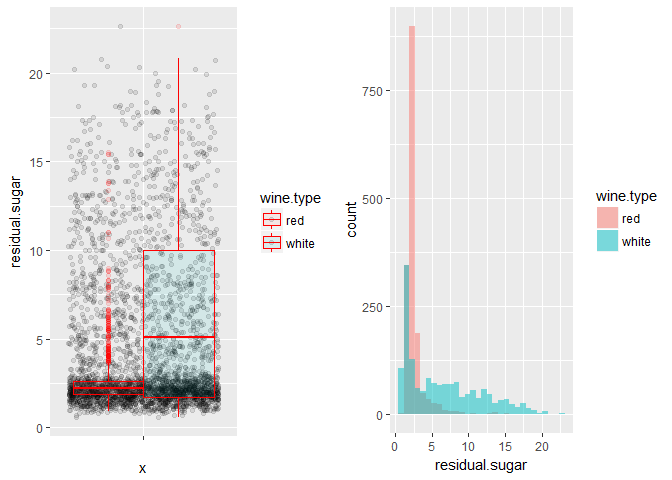<!-- -->

    ## wine_quality$wine.type: red
    ##    Min. 1st Qu.  Median    Mean 3rd Qu.    Max. 
    ##   0.900   1.900   2.200   2.539   2.600  15.500 
    ## -------------------------------------------------------- 
    ## wine_quality$wine.type: white
    ##    Min. 1st Qu.  Median    Mean 3rd Qu.    Max. 
    ##   0.600   1.700   5.100   6.375  10.000  22.600

A large number of white wine samples have an increasing residual
sugar(RS) concentration across the RS scale with values \> 20 g / dm^3,
where as red wine has very less residual sugar concentration for most
samples under 2.5 g / dm^3 and the count of such samples rapidly
decays.How would this stark difference play out in terms of its
interaction with other independent variables and the quality rating,
will be quite
significant.

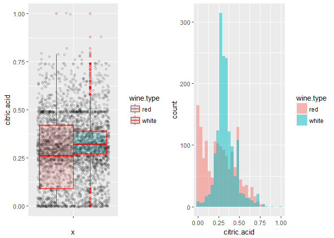<!-- -->

    ## wine_quality$wine.type: red
    ##    Min. 1st Qu.  Median    Mean 3rd Qu.    Max. 
    ##   0.000   0.090   0.260   0.271   0.420   1.000 
    ## -------------------------------------------------------- 
    ## wine_quality$wine.type: white
    ##    Min. 1st Qu.  Median    Mean 3rd Qu.    Max. 
    ##  0.0000  0.2700  0.3200  0.3373  0.3900  1.0000

Median citric acid concentration is very high for white wine samples
with near normal distribution while the concentration is less for red
wine sample.We see red wine samples concentrated at \< 0.25 citric acid
(g / dm^3) with a right skewed
distribution.

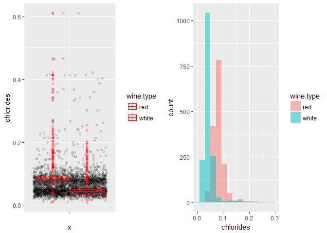<!-- -->

    ## wine_quality$wine.type: red
    ##    Min. 1st Qu.  Median    Mean 3rd Qu.    Max. 
    ## 0.01200 0.07000 0.07900 0.08747 0.09000 0.61100 
    ## -------------------------------------------------------- 
    ## wine_quality$wine.type: white
    ##    Min. 1st Qu.  Median    Mean 3rd Qu.    Max. 
    ## 0.00900 0.03500 0.04300 0.04565 0.05000 0.30100

Majority of White wine samples have lower chloride content with median
at 0.0430 while red wine samples have comparatively greater chloride
content(median = 0.0790). Overall wines have lower salt
content.

<!-- -->

    ## wine_quality$wine.type: red
    ##    Min. 1st Qu.  Median    Mean 3rd Qu.    Max. 
    ##    1.00    7.00   14.00   15.87   21.00   72.00 
    ## -------------------------------------------------------- 
    ## wine_quality$wine.type: white
    ##    Min. 1st Qu.  Median    Mean 3rd Qu.    Max. 
    ##    3.00   23.00   33.00   34.99   45.00  146.50

White wine samples have higher free sulfur di oxide concentration than
red wine.Red wine samples seem to be concentrated under 25 mg / dm^3
with median value of 14.00 while white wine samples have median value of
33.00

<!-- -->

    ## wine_quality$wine.type: red
    ##    Min. 1st Qu.  Median    Mean 3rd Qu.    Max. 
    ##    6.00   22.00   38.00   46.47   62.00  289.00 
    ## -------------------------------------------------------- 
    ## wine_quality$wine.type: white
    ##    Min. 1st Qu.  Median    Mean 3rd Qu.    Max. 
    ##     9.0   108.0   134.0   137.1   165.0   344.0

Like free sulfur di oxide, total sulfur di oxide is more concentrated in
white wine than red wine:red wine samples with median value of just 38
mg / dm^3 compared to 134 mg / dm^3 in white wine
samples.

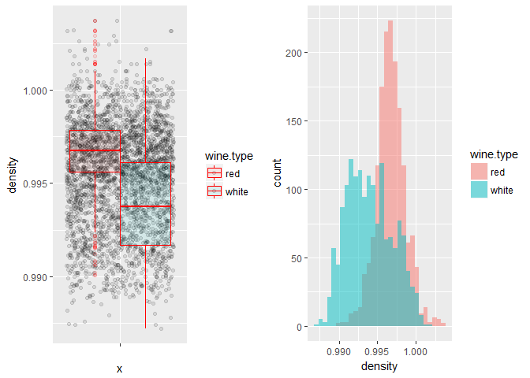<!-- -->

    ## wine_quality$wine.type: red
    ##    Min. 1st Qu.  Median    Mean 3rd Qu.    Max. 
    ##  0.9901  0.9956  0.9968  0.9967  0.9978  1.0037 
    ## -------------------------------------------------------- 
    ## wine_quality$wine.type: white
    ##    Min. 1st Qu.  Median    Mean 3rd Qu.    Max. 
    ##  0.9872  0.9917  0.9937  0.9940  0.9961  1.0017

Some of the white wine samples are less dense compared to red
wine.Overall red wine samples have higher
density.

<!-- -->

    ## wine_quality$wine.type: red
    ##    Min. 1st Qu.  Median    Mean 3rd Qu.    Max. 
    ##  0.3300  0.5500  0.6200  0.6581  0.7300  2.0000 
    ## -------------------------------------------------------- 
    ## wine_quality$wine.type: white
    ##    Min. 1st Qu.  Median    Mean 3rd Qu.    Max. 
    ##  0.2200  0.4000  0.4700  0.4888  0.5500  1.0800

Sulphates, Wine additives to produces SO2 is less in white wine compared
to red, as we see that white wine already has higher SO2
levels.

<!-- -->

    ## wine_quality$wine.type: red
    ##    Min. 1st Qu.  Median    Mean 3rd Qu.    Max. 
    ##   2.740   3.210   3.310   3.311   3.400   4.010 
    ## -------------------------------------------------------- 
    ## wine_quality$wine.type: white
    ##    Min. 1st Qu.  Median    Mean 3rd Qu.    Max. 
    ##   2.790   3.090   3.170   3.186   3.270   3.800

Both the wines seem to have balanced pH levels ranging from around 3.1 -
3.4
(IQR)

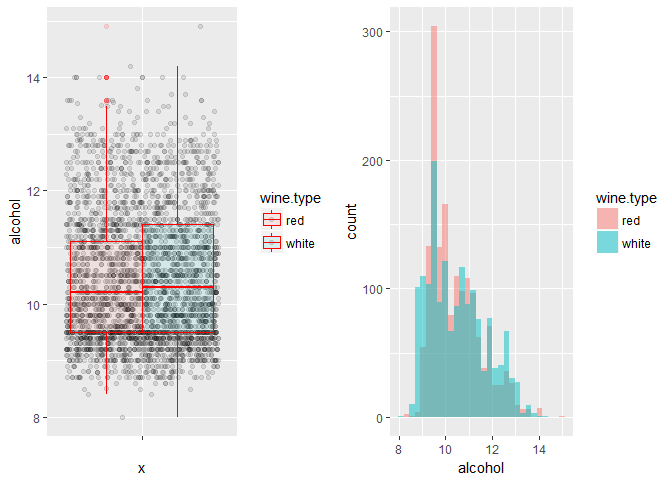<!-- -->

    ## wine_quality$wine.type: red
    ##    Min. 1st Qu.  Median    Mean 3rd Qu.    Max. 
    ##    8.40    9.50   10.20   10.42   11.10   14.90 
    ## -------------------------------------------------------- 
    ## wine_quality$wine.type: white
    ##    Min. 1st Qu.  Median    Mean 3rd Qu.    Max. 
    ##     8.0     9.5    10.3    10.5    11.4    14.2

Both the wines have similar range of alcohol content.The dataset has
more red wine samples below 11 % alcohol by
volume.

<!-- -->

    ## wine_quality$wine.type: red
    ##    Min. 1st Qu.  Median    Mean 3rd Qu.    Max. 
    ##   3.000   5.000   6.000   5.636   6.000   8.000 
    ## -------------------------------------------------------- 
    ## wine_quality$wine.type: white
    ##    Min. 1st Qu.  Median    Mean 3rd Qu.    Max. 
    ##    3.00    5.00    6.00    5.85    6.00    9.00

The dataset has higher red wine samples of quality rating 5 and higher
white wine samples of quality rating
6.

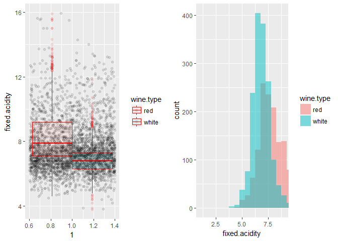<!-- -->

    ## wine_quality$wine.type: red
    ##    Min. 1st Qu.  Median    Mean 3rd Qu.    Max. 
    ##    4.60    7.10    7.90    8.32    9.20   15.90 
    ## -------------------------------------------------------- 
    ## wine_quality$wine.type: white
    ##    Min. 1st Qu.  Median    Mean 3rd Qu.    Max. 
    ##   3.800   6.300   6.800   6.845   7.300  11.800

Red wine has higher fixed acidity concentration than white wine.

# Univariate Analysis

### Structure of dataset

Two datasets:red and white wine sample datasets have been considered for
wine analysis. White wine dataset has 4898 observations while red wine
dataset has 1599 observations.In order to have reasonable
comparison,white wine dataset has been sampled to have the same number
of observations as that of red wine.The attributes of both the samples
have 11 physicochemical properties which are the independent vatriables
and quality as the output / dependent variable.The independent variables
are of class numeric while dependent variable is of class integer.

### Main feature(s) of interest

The main feature of interest is the dependent variable, quality and how
the physiochemicl attributes influence the response variable. The
visualization under univariate plots, indicates that there is a higher
concentration of wines with 5 and 6 quality rating.This is confirmed in
the description section referring to higher samples of normal wine
rather than poor and excellent wine.

### Other features of interest

At this point,all the physiochemical properties considered in the
dataset are important.We shall analyse how each of the properties
directly or indirectly affect each other and ultimately influence the
‘objective’ quality of wine.Point to note : quality per description is
evaluated from a sensory perception.The information provided in the
description about the properties validates this understanding, until
further analysis to rule out or consider primary features of
interest.Each feature plays a role in the winemaking process.Few such
instances:

The pH plot shows near normal distribution with mean and median at 3.25
and 3.24 and the pH values are maintained at 3-4 range, indicating acid
balance needed to provide wine stability and for the effectiveness of
sulfur dioxide.

Wine inherently contains sweetness and acidity.Some of the sugar gets
transformed to alcohol during fermentation.

Sulphates, as an additive produces sulphur di oxide,some of which is
naturally present in wines.Free sulphur di oxide,a component of total
sulphur di oxide is essential to prevent bacterial activity.The amount
depends on the level of acidity and residual sugar to balance acidity
and sweetness
respectively.

### New variables from existing variables in the dataset and other changes.

Since two datasets have been stacked, a new variable,wine.type has been
created and factorized. As we progress in our investigation we shall
create newer variables based on the findings.

The dataset is available in tidy format making it easier for immediate
visualization and manipulation.white\_wine(4898) has more observations
than red\_wine(1599) dataset.For a balanced comparison, white wine has
been sampled to make the count equal to that of red wine data.

# Bivariate Plots

Below is the plot of correlation of the
features.

<!-- -->

## Observations

Summary of the relationship between independent variables and the
correlation between response - independent variable.

1.  The corrplot shows positive correlation between the response
    variable - wine quality and the following predictors :citric
    acid,free sulphur di oxide,pH,sulphates and alcohol.Alcohol has the
    highest correlation with quality at 0.46.

2.  Quality - residual sugar have correlation coefficient at zero ie no
    linear relationship between the two.

3.  Negative correlation is shared with fixed acidity,volatile
    acidity,chlorides,total sulphur di oxide,density and pH.Quality
    improves with decrease in these factors.

4.  Alcohol is positively correlated with citric acid, pH and sulphates
    while negatively correlated with remaining properties.

5.  Sulphates have positive correlation with fixed and volatile
    acidity,citric acid,chlorides,pH.Sulphates are additives added to
    wine which contribute to sulfur dioxide gas.

6.  pH positively correlates with voltile acidity,chlorides,sulpahtes
    and alcohol maintaining acid-base balance.

7.  Free sulfur dioxide - part of total sulfur dioxide is essential for
    wine to prevent microbial and oxidation of wine.

8.  Density has negative correlation with free sulphur di oxide,total
    sulphur di oxide,alcohol and quality, the remaining properties have
    positive correlation.

9.  Citric acid in small quantities adds freshness and flavour to wine
    and understandably negatively correlates to pH,alcohol and volatile
    acidity.

10. Interestingling residual sugar has correlation coefficent of 0 with
    quality.Per information provided about residual sugar,‘it’s rare to
    find wines with less than 1 gram/liter and wines with greater than
    45 grams/liter are considered sweet’ which means there will be some
    amount of residual sugar present in wines (and these can be balanced
    by acidity).

### categorize the ‘quality’ variable

    ## 
    ##    3    4    5    6    7    8    9 
    ##   17  104 1191 1327  492   65    2

<!-- -->

We see a large number of white wine samples of quality rating 6 followed
by 5 while red wine samples have higher count of quality rating 5
followed by 6.

Plotting quality as a factor against other independent varaiables - x
\<-
names(select(wine\_quality,fixed.acidity,volatile.acidity,citric.acid,residual.sugar))
x

<!-- -->

Fixed acidity - Fixed acidty(tartaric acid - g / dm^3) doesnt seem to
impact quality as the value is flat for the quality levels. This should
be expected as the description says,‘most acids involved with wine are
fixed or nonvolatile’. The word fixed would indicate that there will be
some acidity and this ‘some’ is around 7.2 g / dm^3 (median)

Voltile acidity - Volatile acidity(acetic acid - g / dm^3) drops with
increase in quality and stabilizes at Q-7. This concurs with the point
‘too high levels can lead to an unpleasant, vinegar taste’. Volatile
acidity affects quality and it should be on the lower side.Excess
volatile acidity is contained by sulphur di oxide and citric acid as
these share negative correlation.

Citric acid - We can see a marginal increase in citric acid levels at
higher quality levels. It is required in small quantities to add
‘freshness’ and flavor to wines.Citric acid has mild
effect(increasing) at increasing quality levels.

Residual sugar - There will be some amount of residual sugar after
fermentation.We see a stable level of residual sugar only to jump at Q-8
and fall slightly.There is negligible to no effect on quality.Residual
sugar is balanced by acids,chlorides,pH and
alcohol.

<!-- -->

Chlorides - Salt content drops at increasing quality ratings.Chlorides
affect quality,hence needs to be balanced.

Free sulphur di oxide - Free sulphur di oxide is needed to prevent
microbial growth and the oxidation of wine.Free sulphur di oxide
concentration increases with quality ratings. Free sulphur di oxide
affects quality positively.

Total sulphur di oxide - Free sulphur di oxide constitutes part of total
sulphur di oxide . Total sulphur di oxide level increase from Q-3 to
Q-5, wobbles marginally and increases from Q-6 to Q-9.

Density - Density drops at higer quality ratings.Density depends on
alcohol and sugar content. Then at higher quality ratings we should
expect moderate sugar and high alcohol content. Density is positively
correlated to sugar where as negatively correlated to
alcohol.

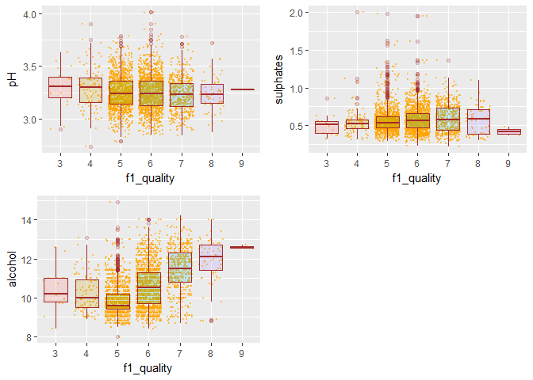<!-- -->

pH drops marginally from Q-4 to Q-5 and stabilizes.There is a slight
increase at Q-9, considering Q-9 has only 2 samples, we can consider
that a stable pH at 3.25 -3.3 is maintained at increasing quality
levels.pH is required to maintain stability and effectiveness of
SO2(sulpur di oxide) .

Alcohol - We see an increasing alcohol content at higher quality ratings
from Q-5 onwards, though we see a slight fall in alcohol median value
from Q-3 to Q-5.

Sulphates - There is a marginal linear increase in sulphate content with
increasing quality ratings.There is a drop at Q-9.Q-9 has only two data
points.

### Summary - Quality vs supporting properties of wine.

We see that alcohol deeply affects quality along with the following:
sulphates (contributes to total sulphur di oxide ), total sulphur di
oxide and includes free sulphur dioxide. volatile acidity and citric
acid. Residual sugar and quality have correlation coeffient of 0.Does
sweetness or the lack of it affect quality needs to be investigated.

The quality parameter will be reduced to three levels - 1. Low - Q-3,Q-4
2. Avg - Q-5,Q-6 3. High - Q-7,Q-8,Q-9

Q-9 has just two records.Instead of creating another level, will be
considered under High.

Alcohol being highly correlated with quality, we shall plot the %alcohol
distribution by
quality.

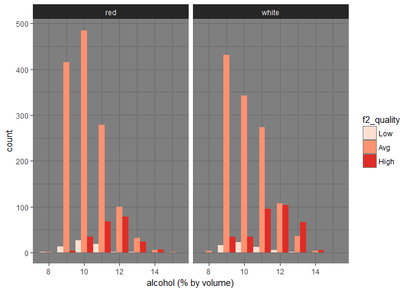<!-- -->

Average quality wine samples under both red and white are large in
numbers.Wines with Average quality rating are available at higher
alcohol levels(alcohol % by volume): 8 through 14.Though there is a
decreasing trend for ‘Avg’ quality rating.

High Quality rating is available from alcohol level of 9% ,with linear
increase till 12% and then decays.12% seem to be highest level of
alcohol content for ‘High’ quality.

Low quality rating is found under alcohol level of 13 starting from
around 9 peaking at 10 and the declines, nonetheless alcohol at 9
through 12 have ‘High’ quality rating.

Applying the second level quality factor to other
properties:

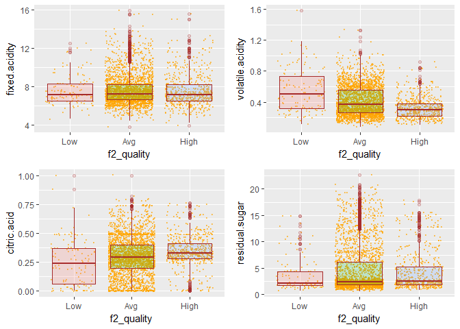<!-- -->

Fixed acidity and residual sugar seem to be maintained at a constant
level.

Citric acid increases linearly with quality:it provides freshness to the
beverage.

volatile acidity has a downward trend as quality improves:excess results
in sourness.

There is negligible increase in residual sugar content with increase in
quality.

<!-- -->

From Low to Avg quality there is marginal increase in the chlorides and
then we see a slight drop in the High quality rating.

free sulphur di oxide is a component of total sulphur di oxide and both
increase with increase in quality.

From Low to Avg quality there is marginal increase in the density and
then we see a drop in density for High quality
rating.

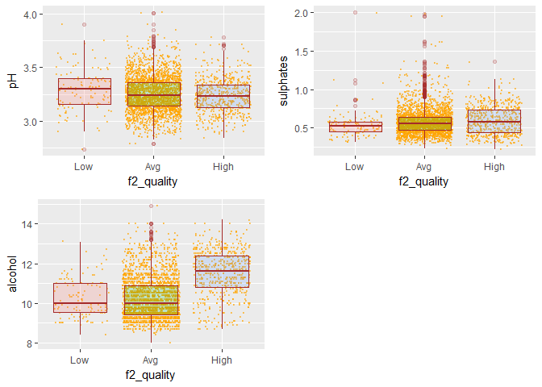<!-- -->

pH level slightly drops at Avg and remains fairly flat at High. Sulphate
levels increase maginally with increase in quality. Alcohol level is
high in high quality wines compared to low and avg quality wines.

### Impact of residual sugar on quality

We have seen that residual sugar and quality have correlation coeffient
of 0.Then does sweetness or the lack of it affect quality.Lets group the
sugar levels using summary details and create a category of sugar
levels.

    ##    Min. 1st Qu.  Median    Mean 3rd Qu.    Max. 
    ##   0.600   1.900   2.400   4.457   5.700  22.600

    ## 
    ##  (0.6,1.9]  (1.9,2.4]  (2.4,5.7] (5.7,22.6] 
    ##        930        705        762        799

    ## [1] "(0.6,1.9]"  "(1.9,2.4]"  "(2.4,5.7]"  "(5.7,22.6]"

    ## [1] "L"   "M"   "H"   "V.H"

    ##    L    M    H  V.H NA's 
    ##  930  705  762  799    2

<!-- -->

Most of the white wine samples have high concentration of sugar at
nearly all quality levels :3,4,5,6,7,8 .White wine seems to be inclined
towards sweetness. Similarly red wine also has V.H concentration of
sugar for the same set of quality levels as white wine however,with way
lower count than samples at L and M level of sugar. We had seen marginal
linear increase in RS level with increase in quality after grouping
quality levels. This increase is contributed by white wine sweeetness.We
can infer here that generally white wines are sweeter than red wine.

Below plots analyse how residual sugar works with other
chemicals-

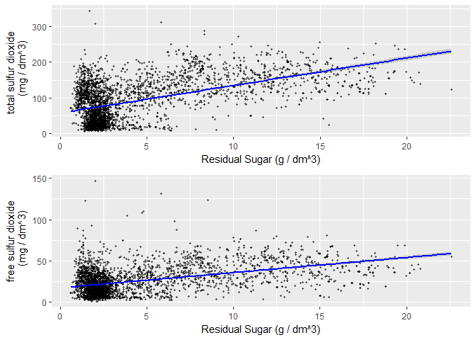<!-- -->

RS level increases linearly with increase in both free and total
SO2(free SO2 is a compoenent of total
SO2).

<!-- -->

Total acidity (sum of fixed and volatile acidity) decreases with
increase in RS
concentration.

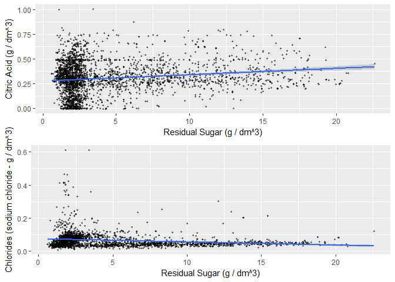<!-- -->

Chloride levels declines as it is balanced by increasing rs levels.

Citric acid level increases to balance the increasing
sweetness.

<!-- -->

pH and sulpahte levels decline with increase in RS
levels.

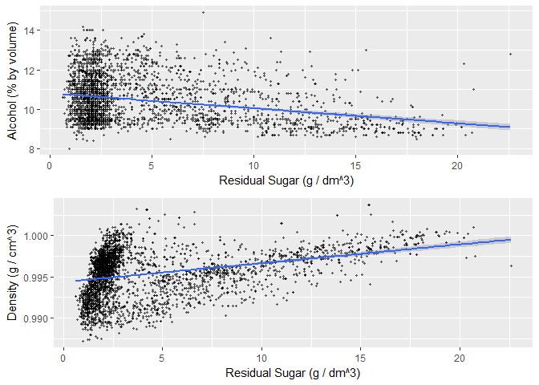<!-- -->

RS contributes to density.Since most of inherent sugar gets converted to
alcohol,alcohol also contributes to sweetness.We wouldnt want both the
components increasing.At higher RS levels,alcohol required is low.

# Bivariate Analysis

The correlation coefficient between quality and residual sugar is 0. The
distribution of quality ratings for different sugar levels shows all
sugar levels across quality ratings without a clear pattern.On grouping
the quality levels against residual sugar we see a marginal increase of
RS levels at increasing quality levels.

Total acidity(volatile acidity+fixed acidity) and pH levels decrease at
higher levels of residual sugar, especilaly volatile acidity level and
pH.

Toatal sulphur di oxide(inclusive of free SO2) and sulphate levels
decline at higher RS levels.Sulphites release SO2 which combines with RS
to form bound SO2.Wines inherently have some amount of SO2.

Higher RS will need higher citric acid (mariginal linear increase) to
combat sweetness with freshness and flavour.

Chlorides levels decline at higher RS levels,reducing saltiness.

RS contributes to density.Since most of inherent sugar gets converted to
alcohol during fermentation,alcohol also contributes to sweetness.At
higher RS levels,alcohol required is low so as not to overload wines
with sweetness.

From the plots,observations and correlation coefficient(0.55) we see
that residual sugar has the strongest relationship with total sulphur di
oxide.

# Multivariate Plots

Investigating the behavior of residual sugar with other chemicals
further,we will now consider how the samples of varied sugar levels for
both red and white wines are distributed against
quality.

<!-- -->

Red wine samples have very low concentration of V.H sugar(\> 5.7 g /
dm^3).Even the H concentration is within 5 g / dm^3.More H level samples
are packed at \< 4 g / dm^3.We see V.H Sugar level at quality 7.Note
there are fewer data points at Q-8.Quality improves marginally at higher
RS levels.

White wine samples have high samples with V.H sugar levels.Even the H
sugar levels are scattered at levels \>4 g / dm^3.There are v.H sugar
levels high quality levels(7,8) and also low quality levels(3,4).Quality
drops marginally at higher RS levels.

Red wines are less sweeter than White
wines.

<!-- -->

% Alcohol by volume tends to increase linearly with quality in both red
and white wine samples. Since alcohol already has some amount of
sweetness and we know red wines are less sweet than white wine,we donot
see V.H sugar levels in red wine. In white wine samples, V.H sugar level
samples are concentrated at alcohol level below 10.5% and decreases
thereafter with lower sugar level samples increasing after 10.5%
alcohol. % Alcohol by volume increases with decrease in RS
levels.

<!-- -->

Higher Total sulphur di oxide levels lowers quality level in both red
wine and white wine. Total SO2 is maintained at small concentration in
wine.Total SO2 is \< 150 mg / dm^3 in red wine. Note that more the RS
level, greater SO2 is need,since red wine has lower RS concentration,
small amounts of SO2 is needed.

White wines tends to have large total SO2 levels \> 200 mg / dm^3.We can
see that V.H sugar levels concentration is at higher SO2 levels.More SO2
is needed to react with RS to form bound SO2 which is a component of
total SO2 and this leaves more free SO2 increasing SO2
levels.

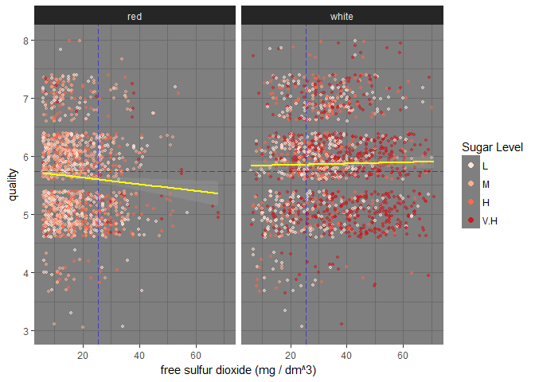<!-- -->

Free sulphur di oxide has less impact on quality, in the sense free SO2
level is maintained in a balanced manner.Free SO2 is necessary to
prevent oxidation and to increase shelf life.In white wines, due to
higher sweetness level, there is a negligeble increase in free SO2 at
under Q-6 level while there is negligible decrease in free SO2 in red
wine, due to lower
RS.

<!-- -->

Fixed acidity level is higher in red wine than white wine. Red wine has
fixed acidity (tartaric acid) at levels \> 12 g / dm^3 while white wine
has \<10 g / dm^3 most of which is packed under 8 g / dm^3.Red wine
quality imporves with increase in fixed acidity while white wine quality
decreases.

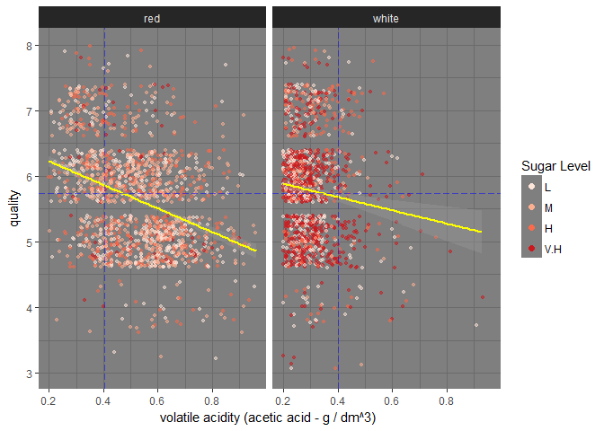<!-- -->

Volatile acidity defines the amount of acetic acid.High acetic acid
content affects taste.Acetic acid level is higher in red wine compared
to white wine and also affects quality:quality drops at higher acetic
acid concentration.High volatile acidity contributes to wine
faults.

<!-- -->

Citric acid adds freshness.Most of white wine samples have citric acid
level concentrated at values \> 0.2 g/dm^3 and \< 0.4 g/dm^3 while most
red wine samples have citric acid content distributed from 0.05 g/dm^3
to 0.5 g/dm^3 .Quality improves with increase in citric acid levels in
red wine while quality declines negligibly at higher citric acid levels
in white
wine.

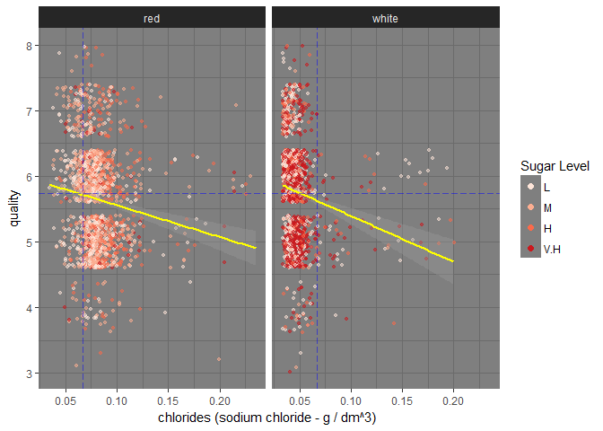<!-- -->

Chloride level is higher in red wine compared to white wine
samples.While most white wine samples are concentrated at just under
0.05 g / dm^3 of sodium chloride, red wine samples are concentrated at
values \> 0.08 g / dm^3 of sodium chloride.Lower chloride levels
improves quality for both red and white wine
samples.

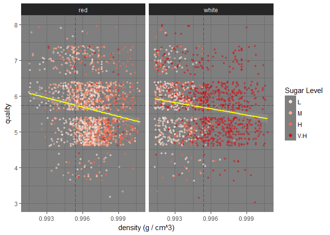<!-- -->

Lower density improves quality marginally for both the wine types.Most
of red wine samples have high density at values \> 0.995 g / cm^3.White
wine samples with V.H sugar level have high density at levels \> 0.995.
RS contributes to
density.

<!-- -->

Most of the wine samples have pH levels in range of 3-3.8 Quality drops
marginally for increasing pH for red wine while it improves for white
wine which makes sense as white wine has more sweetness to be
balanced.

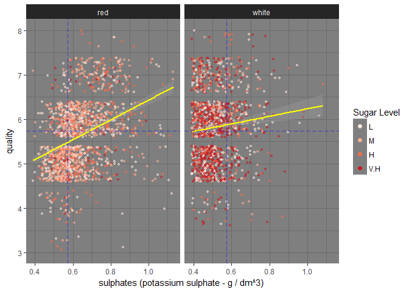<!-- -->

Sulpahtes improve quality linearly for both red and white wine more so
for red wine.Sulphates produce SO2 which is used by RS (higher in white
wine) to form bound SO2.For the same quantity of sulphates added,
quality impact is strongly visible as they have less rs to bind to.

# Multivariate Analysis

In sum,we see all these chemical properties affect each other wherein
some of the properties are kept in balance by the other properties.An
equillibrium is maintained by the interplay of these chemicals so as to
produce a sensory pleasing quality of flavors.

Chlorides are maintained at a lower level as we cannot have salty wines.
Alcohol level is on the higher side in High quality wines and this in
turn affects density which gets lowered.White wine samples which donot
have High sugar content have higher alcohol %.

Total sulphur di oxide is on the higher side in High quality wines so is
free sulphur di oxide, one of the components of total SO2 (bound sulphur
di oxide is the other component).This is necessary to maintain shelf
life, it being anti bacterial and anti oxident.Besides, being produced
in the wines during fermentation, additives are added in the form of
sulphates(should be read as sulphites) to increase SO2.Hence we see
slightly higher levels of sulpahtes at higher quality levels.It also
influences acidity with lower

Median Residual sugar(RS) level increases marginally with quality. RS
reacts with SO2 to form bound SO2(part of total SO2) reducing free
SO2.More free SO2 is needed(we see it increase linearly with quality) to
prevent oxidation. RS also reacts with acidity and pH to balance
sweetness level(s).% Alcohol by volume decreases at higher RS levels.

Quality drops marginally for white wine at V.H sugar level which makes
sense as white wine has more sweetness to be balanced at V.H level.While
for red wine, RS being on lower side would do well with RS as quality
improves with marginal increase in RS.

Higher citric acid contributes to better quality especially in red wine
while has negligible negative effect on quality in white wine samples.

Fixed acidity and volatile acidity together form total acidity.Lower
tartaric acid at higher quality level is observed in white wine.Increase
in tartaric acid affects quality negatively in white wine samples.Higher
fixed acidity in red wines improves the
quality.

# Final Plots and Summary

### Quality distribution across residual sugar levels

<!-- -->

From the correlation plot, we know that quality and residual sugar share
non linear relationship with a correlation coefficient of 0.This
warrants more exploration to understand how residual sugar impacts or
doesnt impact quality.In the above plot,we see different levels of sugar
interspersed at all quality levels :low level of sugar at quality \>6
and also at \<5 and high level of sugar at quality \>6 and also at \<5.

Most of the white wine samples have high concentration of sugar at
nearly all quality levels :3,4,5,6,7,8 indicating white wine seems to be
inclined towards sweetness. Similarly red wine also has V.H
concentration of sugar at same set of levels as white wine however,with
higher number of samples at L and M level of sugar. This forms the basis
for further exploration of sugar levels and their interation with other
properties.

### Residual Sugar effect on Quality

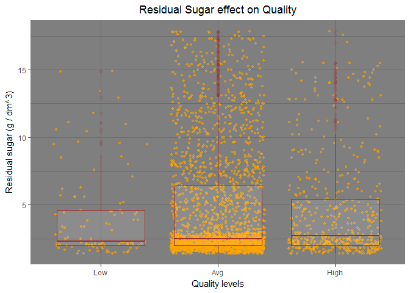<!-- -->

In the bivariate analysis of residual sugar vs quality, quality ratings
have been categorized to three levels : Low(Q-3,Q-4) ,Avg(Q-5,Q-6) and
High(Q-7,Q-8,Q-9). We see a marginal increase in the RS levels at
increasing quality levels. Would this negligible increase impact
quality?

### % ABV and Residual Sugar levels

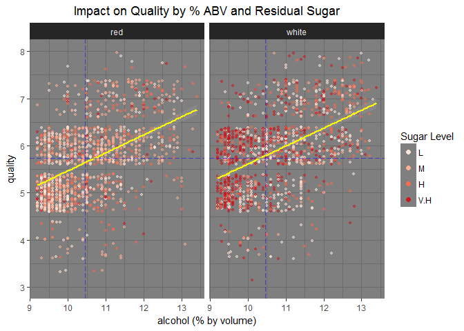<!-- -->

This multivariate plot considers a third variable,alcohol which has the
highest correlation coefficient of 0.46 with the response variable,
quality with distribution of sugar levels in the background.Selection of
sugar level(residual sugar) is relevant in the sense that RS has non
linear relationship with quality.

% Alcohol by volume tends to increase linearly with quality in both red
and white wine samples. Since alcohol already has some amount of
sweetness due to sugar coverting to alcohol during fermentation and
leaving behind residual sugar,we know red wines are less sweet than
white wine. We donot see V.H sugar level concentration in red wine like
that of white wine.In white wine, V.H sugar level is present at low
alcohol %. With decline RS levels we see increase in alcohol levels. Red
wine samples with lower Rs levels see increase in Quality with increase
in alcohol %.

With the introduction of third variable we see how RS contributes to
quality.This is one such example of the influence of a third variable on
RS and their effect on quality. Going over the RS level impact on
quality for different chemical properties analysed under ‘Multivariate
Analysis’, we see how RS interacts with other properties contributing to
quality.

# Reflection

Per French oenologist, Emile Peynaud: ‘The quality of a wine is the
totality of its properties, that is to say the properties which render
it acceptable or desirable.’ In effect it is the totally subjective
pleasure provided by drinking the wine which conditions judgment …
Quality only exists in relation to this individual and then only in as
far as he has the ability to perceive it and approve it. (Peynaud, 1987
p. 220).

All of the physiochemical properties provided were required to
understand the interactions between each of them. We are determing
‘Quality’ which is a sensory perception using physiochemical
properties that exhibit complex interactions to produce the desired
flavors.That being said, by making available the category of flavors,a
sensory preference or a profile which maps the quality, analysing the
interactions would have been fruitful.The data that is made available
has fewer to nil lower and superior wine data which could have added
weight to data analysis.

The corrplot was crucial to understand the interactions of the chemicals
which required further research emphasizing the need to understand the
basics of the domain atleast from the data perspective in order to
perform effective analysis.Another area which required a lot of effort
was in visualizing the interations-how best to capture the not so
obvious relationship between the variables which can be telling.

# References

<http://www.gencowinemakers.com/docs/Acids%20Presentation.pdf>
<http://www.sthda.com/english/wiki/be-awesome-in-ggplot2-a-practical-guide-to-be-highly-effective-r-software-and-data-visualization>
<http://www.winesofbalkans.com/sulphur-dioxide-so2-the-single-most-useful-additive-in-the-winemaking-process.html>
<http://www.scielo.br/pdf/bpsr/v7n1/02.pdf>
